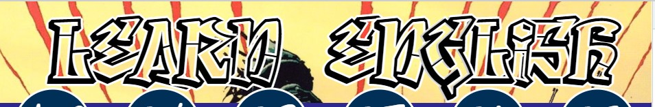
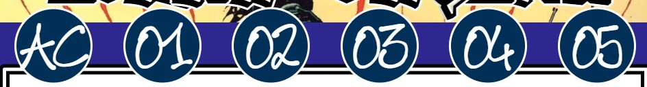
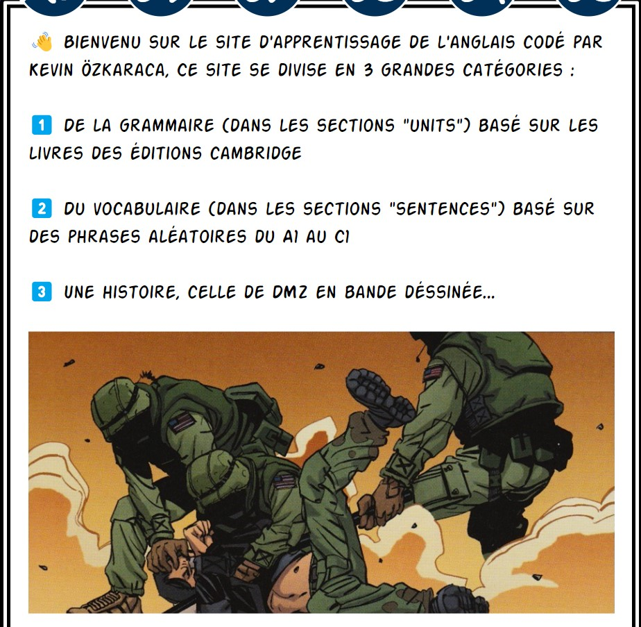
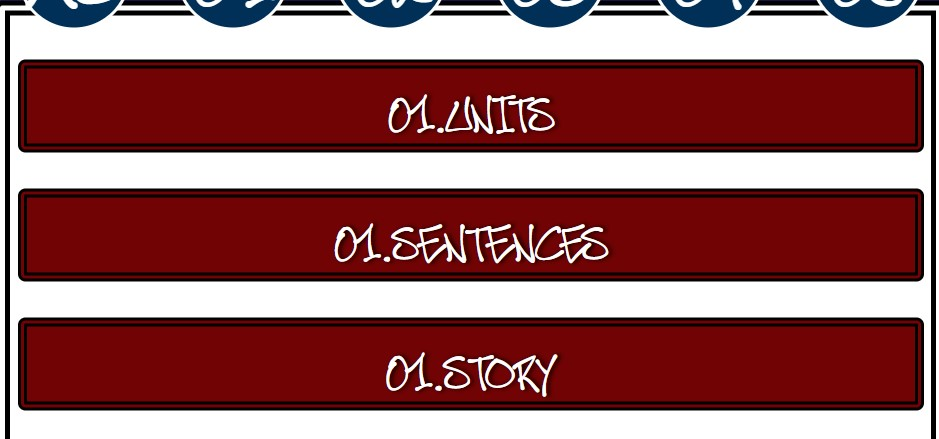

## Site d'apprentissage de l'anglais :

A voir ici : https://kevinozkaraca.github.io/Site_Pour_Langlais/

## Explication du code CSS :

header ---> entete du site

        

nav       --->  barre de navigation

        

section   --->  information en page d'accueil

        

article   --->  page ou se trouve les

        

## Mes reseaux sociaux :

        
        
        
        
        
        
      

